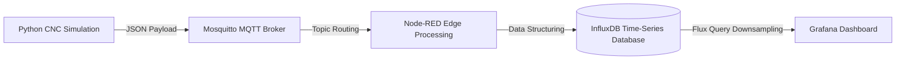

# Industrial Edge Telemetry Pipeline

## Objective
An end-to-end edge computing architecture designed to extract, route, and visualize high-frequency machine telemetry. This serves as the foundational data infrastructure required for IIoT Digital Twin condition monitoring, built in preparation for the CREDIT project at TU Chemnitz.

## System Architecture

## Live Dashboard Output

## Data Flow & Module Breakdown

1. **Edge Simulation (`iot_gateway.py`):** A Python routine utilizing `paho-mqtt` to simulate thermal and mechanical physics of a CNC machine. Structures telemetry into JSON envelopes.
2. **Message Broker (Eclipse Mosquitto):** The lightweight publish/subscribe nervous system running on `localhost:1883`, decoupling data generation from database ingestion.
3. **Stream Processing (Node-RED):** Subscribes to the MQTT topic, parses the JSON payload, and formats the time-series data for secure database insertion.
4. **Time-Series Database (InfluxDB):** High-write-performance data store operating on port `8086`. Archives the real-time stream into designated buckets.
5. **Visualization Layer (Grafana):** Connects to InfluxDB via Flux queries. Utilizes `aggregateWindow` functions mapped to `$__interval` for dynamic, pixel-perfect data downsampling on the UI.

## Prerequisites & Local Setup

To reproduce this pipeline locally:
1. Install **Python 3.x** and run `pip install -r requirements.txt`.
2. Ensure **Mosquitto**, **Node-RED**, **InfluxDB**, and **Grafana** are installed and running locally.
3. Import `NodeRED_Flow.json` into your local Node-RED instance.
4. Import `Grafana_Dashboard.json` into Grafana and configure the InfluxDB data source.
5. Execute the Python script to begin publishing telemetry to `factory/chemnitz/cnc_1/sensors`.

## Future Work & Roadmap
* **Containerization:** Wrap the infrastructure layer (Broker, Node-RED, DB, Grafana) into a `docker-compose.yml` stack for single-command deployment.
* **Industrial Protocols:** Replace the Python simulation layer with a local OPC UA Server to mirror true factory-floor hardware integration.
