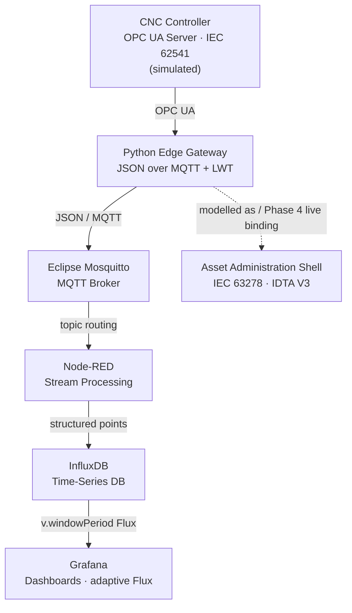

# Industrial Edge Telemetry & Semantic Digital Twin (AAS)

An end-to-end, fully containerized IIoT data infrastructure for condition monitoring — bridging the gap from raw OPC UA shop-floor data to a standardized Asset Administration Shell (AAS).

[](https://www.python.org/)
[](https://mosquitto.org/)
[](https://nodered.org/)
[](https://www.influxdata.com/)
[](https://grafana.com/)
[](https://docs.docker.com/compose/)


---

## 📌 Objective

An end-to-end, fully containerized edge computing architecture designed to extract, route, store, and visualize machine telemetry. Built as a foundational data infrastructure for IIoT Digital Twin condition monitoring, supporting my M.Sc. Advanced Manufacturing research at TU Chemnitz.

The project addresses a real manufacturing problem: industrial production lines generate continuous sensor data from PLCs, CNC machines, and discrete equipment. Without a reliable pipeline to capture, transform, and visualize this telemetry, predictive-maintenance analytics and digital-twin frameworks have no foundation. This repository demonstrates the IT–OT infrastructure layer that makes downstream semantic modelling and machine learning possible.

---

## 🏗️ System Architecture


```mermaid
flowchart TD
    PLC["CNC Controller<br/>OPC UA Server · IEC 62541<br/>(simulated)"]
    GW["Python Edge Gateway<br/>JSON over MQTT + LWT"]
    BROKER["Eclipse Mosquitto<br/>MQTT Broker"]
    NR["Node-RED<br/>Stream Processing"]
    DB["InfluxDB<br/>Time-Series DB"]
    GRAF["Grafana<br/>Dashboards · adaptive Flux"]
    AAS["Asset Administration Shell<br/>IEC 63278 · IDTA V3"]

    PLC -- "OPC UA" --> GW
    GW -- "JSON / MQTT" --> BROKER
    BROKER -- "topic routing" --> NR
    NR -- "structured points" --> DB
    DB -- "v.windowPeriod Flux" --> GRAF
    GW -. "modelled as / Phase 4 live binding" .-> AAS
```

The architecture follows a modern IT/OT convergence pattern:

1. **OT Layer:** An OPC UA server (`opcua_server.py`) simulates a CNC machine controller, exposing telemetry over OPC UA (IEC 62541).
2. **Edge Gateway:** A Python gateway acquires the telemetry and publishes it as JSON over MQTT, with a Last Will and Testament (LWT) for connection resilience.
3. **IT Infrastructure:** Eclipse Mosquitto routes topics, Node-RED parses streams into InfluxDB, and Grafana visualizes the time-series with adaptive downsampled Flux queries.
4. **Semantic Layer (Industrie 4.0):** The machine is modelled as an Asset Administration Shell (`CNC_1_Twin.aasx`) following AAS Specification V3 (IDTA / IEC 63278), making the asset machine-readable for downstream analytics.

> **What runs live vs. standalone (honest scope):** The containerized pipeline (edge → MQTT → Node-RED → InfluxDB → Grafana) runs end to end. The OPC UA server/gateway (`phase2_opcua/`) and the AAS twin (`phase3_aas/`) are included as standalone modules; wiring the OPC UA gateway into the containerized path and live-binding the AAS `OperationalData` submodel are tracked as Phase 4.

---

## 🛠️ Tech Stack

| Layer | Technology | Role |
|---|---|---|
| Semantic Twin | AASX Package Explorer · AAS V3 (IEC 63278) | Standardized machine shell and operational submodels |
| Machine Protocol | OPC UA · asyncua | Machine-controller telemetry over OPC UA (IEC 62541), simulated |
| Edge Gateway | Python 3.11 · paho-mqtt | Telemetry simulation, MQTT publishing with LWT |
| Messaging | Eclipse Mosquitto 2.0 | MQTT broker, topic-based routing |
| Stream Processing | Node-RED 3.x | Payload parsing, transformation, InfluxDB write |
| Storage | InfluxDB 2.7 | Time-series database with retention |
| Visualization | Grafana 10.x | Dashboards with custom Flux queries |
| Orchestration | Docker · Docker Compose | Reproducible deployment (one-time provisioning of flow + dashboard) |

---

## 📁 Repository Structure

```
.
├── cnc_sensor.py                 # Python edge gateway (MQTT publisher with LWT)
├── Dockerfile                    # Builds the cnc-gateway container image
├── docker-compose.yml            # Orchestrates the containerized services
├── requirements.txt              # Python dependencies for the edge gateway
├── NodeRED_Flow.json             # Importable Node-RED flow definition
├── Grafana_Dashboard.json        # Importable Grafana dashboard definition
├── machine_temp_downsample.flux  # Custom Flux query for adaptive downsampling
├── dashboard.png                 # Screenshot of the live dashboard
├── phase2_opcua/                 # Phase 2 — OPC UA module
│   ├── opcua_server.py           #   Simulated CNC controller (OPC UA server)
│   └── opcua_client.py           #   OPC UA -> telemetry gateway
├── phase3_aas/                   # Phase 3 — Asset Administration Shell
│   ├── CNC_1_Twin.aasx           #   AAS digital twin (IEC 63278)
│   └── README.md                 #   What the twin models
├── .github/
│   └── workflows/
│       └── ci.yml                # CI: compose validation + py-compile
├── LICENSE                       # MIT
└── README.md
```

---

## 🚀 Quick Start

**Prerequisites:** Docker Desktop (or Docker Engine with Docker Compose v2) installed.

```bash
# Clone the repository
git clone https://github.com/nitin-iiot/IIoT-Edge-Telemetry-Pipeline.git
cd IIoT-Edge-Telemetry-Pipeline

# Start the full stack
docker compose up -d

# Verify the services are running
docker compose ps
```

Then open in your browser:

| Service | URL | Default credentials |
|---------|-----|---------------------|
| Grafana | http://localhost:3000 | `admin` / `admin` (change on first login) |
| Node-RED | http://localhost:1880 | — |
| InfluxDB | http://localhost:8086 | configured on first run |

To stop the stack:

```bash
docker compose down
```

---

## ⚙️ Configuration

The Python edge gateway reads its MQTT broker target from environment variables. Defaults are set for the Docker Compose network and can be overridden via the `environment` block in `docker-compose.yml` or a `.env` file.

| Variable | Default | Description |
|----------|---------|-------------|
| `MQTT_BROKER` | `mqtt-broker` | Hostname or IP of the MQTT broker |
| `MQTT_PORT` | `1883` | MQTT broker port |
| `MQTT_TOPIC` | `factory/chemnitz/cnc_1/sensors` | Telemetry publish topic |
| `MQTT_STATUS_TOPIC` | `factory/chemnitz/cnc_1/state` | Connection-state topic (LWT) |

---

## 🧰 Development Environment

- **Runtime:** Python 3.11, Docker + Docker Compose v2
- **Host:** OS-agnostic — developed on Windows, runs equally on Linux/macOS

---

## 🔁 Reproducing the Full Setup

For first-time setup after `docker compose up -d`, the Node-RED flow and Grafana dashboard need to be imported once. After this initial step, both configurations persist via Docker volumes across restarts.

### Step 1 · Import the Node-RED flow

1. Open Node-RED at <http://localhost:1880>
2. Menu (top right) → **Import**
3. Select **upload a file** and choose `NodeRED_Flow.json` from this repository
4. Click **Import**, then **Deploy** (red button, top right)

### Step 2 · Connect Grafana to InfluxDB

1. Open Grafana at <http://localhost:3000>
2. Sign in (default `admin` / `admin`) and change the password
3. **Connections → Data sources → Add data source → InfluxDB**
   - Query language: **Flux**
   - URL: `http://influxdb:8086`
   - Organization, token, and bucket: as configured during InfluxDB first-run setup at <http://localhost:8086>

### Step 3 · Import the Grafana dashboard

1. **Dashboards → New → Import**
2. Upload `Grafana_Dashboard.json`
3. Select the InfluxDB data source created in Step 2 and click **Import**

The custom downsampling query lives in `machine_temp_downsample.flux` — Grafana's panel references it via the `v.windowPeriod` variable for adaptive resolution at any time range, from the last minute to a full historical run.

### Verifying the data flow

After completing the steps above:

1. Grafana should display live `MACHINE_TEMP` values updating every few seconds
2. Node-RED's debug panel should show incoming JSON payloads under `factory/chemnitz/cnc_1/sensors`
3. The dashboard's threshold line at 100 °C should mark the overheating boundary, with the Stat panel reflecting the current value

---

## 🗺️ Project Roadmap

| Phase | Scope | Status |
|---|---|---|
| **Phase 1** | Data infrastructure — Python edge, MQTT, Node-RED, InfluxDB, Grafana, Docker | ✅ Complete |
| **Phase 2** | OPC UA integration — telemetry from a simulated CNC controller into the pipeline (IEC 62541) | ✅ Complete |
| **Phase 3** | Semantic digital twin — Asset Administration Shell (AAS Spec V3, IEC 63278), modelled in AASX Package Explorer | ✅ Complete |
| **Phase 4** | Live binding — stream OPC UA values into the AAS `OperationalData` submodel; anomaly detection on the thermal series | 🟡 In progress |
| **Phase 5** | Semantic enrichment — align AAS submodels to IOF / BFO ontologies for cross-vendor interoperability | 🟢 Planned (research direction) |

---

## 👤 About

Built by **Nitin Senthilkumar**, M.Sc. Advanced Manufacturing student at **Technische Universität Chemnitz** (TU Chemnitz). Manufacturing-engineering background with focus on Industry 4.0, the IT–OT interface, and industrial data systems.

- 📧 [nitin.senthilkumar@s2025.tu-chemnitz.de](mailto:nitin.senthilkumar@s2025.tu-chemnitz.de)
- 🎓 M.Sc. Advanced Manufacturing · TU Chemnitz

---

## 📄 License

This project is licensed under the MIT License.

```
MIT License

Copyright (c) 2026 Nitin Senthilkumar

Permission is hereby granted, free of charge, to any person obtaining a copy
of this software and associated documentation files (the "Software"), to deal
in the Software without restriction, including without limitation the rights
to use, copy, modify, merge, publish, distribute, sublicense, and/or sell
copies of the Software, and to permit persons to whom the Software is
furnished to do so, subject to the following conditions:

The above copyright notice and this permission notice shall be included in all
copies or substantial portions of the Software.

THE SOFTWARE IS PROVIDED "AS IS", WITHOUT WARRANTY OF ANY KIND, EXPRESS OR
IMPLIED, INCLUDING BUT NOT LIMITED TO THE WARRANTIES OF MERCHANTABILITY,
FITNESS FOR A PARTICULAR PURPOSE AND NONINFRINGEMENT. IN NO EVENT SHALL THE
AUTHORS OR COPYRIGHT HOLDERS BE LIABLE FOR ANY CLAIM, DAMAGES OR OTHER
LIABILITY, WHETHER IN AN ACTION OF CONTRACT, TORT OR OTHERWISE, ARISING FROM,
OUT OF OR IN CONNECTION WITH THE SOFTWARE OR THE USE OR OTHER DEALINGS IN THE
SOFTWARE.
```
