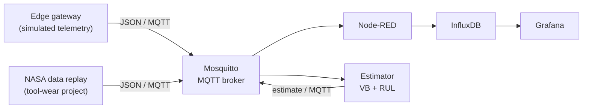

# IIoT Condition Monitoring — Telemetry Pipeline & Tool-Wear Estimator

A containerized MQTT → Node-RED → InfluxDB → Grafana pipeline for machine
condition monitoring, and a condition-monitoring project built on top of it:
estimating tool flank wear from spindle motor current.

[](https://www.python.org/)
[](https://mosquitto.org/)
[](https://nodered.org/)
[](https://www.influxdata.com/)
[](https://grafana.com/)
[](https://docs.docker.com/compose/)

---

## What's here

Two pieces that share one data backbone:

1. **Tool-wear estimation from spindle current** — the condition-monitoring
   result. Flank wear can't be measured while a machine cuts; this infers it
   from the motor current the machine already draws, and reports remaining
   useful life. Blind-tested on unseen data, with a documented failure point.
2. **A simulated telemetry pipeline** — the reusable IT/OT backbone (edge
   gateway → MQTT → Node-RED → InfluxDB → Grafana, in Docker) that I built
   first to learn the stack. The tool-wear project streams over the same
   pipeline.

Honest scope up front: there is **no real machine and no OPC UA client here.**
Data is either simulated by the gateway or replayed from a public dataset. I
used AI as a tutor for the container and MQTT concepts; what I can stand behind
and explain is the signal reasoning, the data handling, and the pipeline.

---

## Project 1 — Tool-wear estimation from spindle current

**The idea.** Flank wear (VB) is measured by stopping the spindle and looking
under a microscope. You can't do that mid-cut. So it's a virtual-sensor
problem: infer what you can't measure (wear) from what you can (motor current).

**Data.** NASA milling dataset (public, from the NASA Prognostics Data
Repository): 167 recordings across 16 tools. 165 analysed after excluding two
corrupted runs with a median-based rule per tool. Missing microscope readings
are dropped, not interpolated.

**Method.**
- For each cut, compute the AC spindle-current rise relative to that tool's
  first cut. Taking a ratio to the first cut cancels the unknown per-setup gain.
- Fit a straight line between that rise and the measured flank wear on **one**
  tool: `VB = 0.335 · r + 0.085`, R² = 0.91 (n = 14).
- **Blind test** on a second tool the fit never saw: mean absolute error
  **0.043 mm** below the 0.30 mm ISO 3685 wear limit, **0.155 mm** above it.

**The result I actually talk about — the failure one.** The estimator reports
the wear-limit crossing **three cuts late**. A single current channel loses the
wear signal near end of life, exactly where it matters most. That's a measured
ceiling of a one-signal model, not a bug — and the concrete argument for adding
a second channel (vibration or force).

**How it runs.** `replay.py` streams a tool's raw recordings over MQTT, one
cut at a time, like a live machine. `estimator.py` subscribes, predicts wear
and remaining useful life, and **never** subscribes to the reference channel —
so the error is a genuine out-of-sample error. Node-RED writes both to InfluxDB;
Grafana shows estimate against measurement, with a colour-coded countdown to the
wear limit.

```bash
# from the repo root, with the pipeline already up (see Quick start)

# terminal 1 — start the estimator (it takes its fresh-tool baseline from
# the first message, so start it first)
python tool_wear/estimator.py

# terminal 2 — replay a held-out tool over MQTT
python tool_wear/replay.py --case 11 --speed 3.0
```

---

## Project 2 — Simulated telemetry pipeline

The backbone the tool-wear project runs on, built first on its own to learn the
IIoT data stack end to end.


```mermaid
flowchart LR
    SIM["Edge gateway<br/>(simulated telemetry)"]
    REPLAY["NASA data replay<br/>(tool-wear project)"]
    BROKER["Mosquitto<br/>MQTT broker"]
    NR["Node-RED"]
    DB["InfluxDB"]
    GRAF["Grafana"]
    EST["Estimator<br/>VB + RUL"]

    SIM -- "JSON / MQTT" --> BROKER
    REPLAY -- "JSON / MQTT" --> BROKER
    BROKER --> NR --> DB --> GRAF
    BROKER --> EST -- "estimate / MQTT" --> BROKER
```

- **Edge gateway** (`edge_gateway.py`) — publishes JSON telemetry over MQTT,
  with a Last Will & Testament so a dropped gateway is detected instantly.
- **Mosquitto** — MQTT broker.
- **Node-RED** — parses the stream into InfluxDB.
- **InfluxDB / Grafana** — time-series storage and a live dashboard (Flux,
  with `v.windowPeriod` downsampling for readable history at any time range).

The whole stack comes up with one `docker compose up`. In a real deployment the
gateway's value would come off the controller (OPC UA, Modbus, an analog input);
simulating it lets the rest of the pipeline be built and tested without a machine.

---

## Tech stack

| Layer | Technology |
|---|---|
| Signal / data work | Python 3.11 · pandas · NumPy · Matplotlib |
| Edge gateway & replay | Python · paho-mqtt |
| Broker | Eclipse Mosquitto 2.0 |
| Stream processing | Node-RED 3.x |
| Storage | InfluxDB 2.7 |
| Visualization | Grafana 10.x (Flux) |
| Orchestration | Docker · Docker Compose |


> The raw NASA `mill.mat` is not redistributed here — download it from the NASA
> Prognostics Data Repository. `runs.csv` holds the per-cut features derived from it.

---

## Quick start (pipeline)

**Prerequisites:** Docker Desktop, or Docker Engine with Compose v2.

```bash
git clone https://github.com/nitin-iiot/IIoT-Edge-Telemetry-Pipeline.git
cd IIoT-Edge-Telemetry-Pipeline
docker compose up -d
docker compose ps
```

| Service | URL |
|---------|-----|
| Grafana | http://localhost:3000 |
| Node-RED | http://localhost:1880 |
| InfluxDB | http://localhost:8086 |

On first run, import `NodeRED_Flow.json` in Node-RED (Menu → Import → Deploy),
point Grafana at InfluxDB (Flux, URL `http://influxdb:8086`), and import
`Grafana_Dashboard.json`. Both persist via Docker volumes afterwards.

Stop with `docker compose down`.

---

## Honest scope

- **Real and mine to defend:** the signal reasoning (why current rise tracks
  wear, why a ratio to the first cut cancels the setup gain), the data handling
  (outlier rule, honest treatment of missing labels, an out-of-sample split
  that never touches the reference channel), and running the MQTT → Node-RED →
  InfluxDB → Grafana pipeline.
- **Learned with AI as a tutor:** the container and MQTT scaffolding. I can
  read and debug this stack faster than I can yet write it unaided.
- **Not here:** a real machine, an OPC UA client, multi-sensor fusion, or a
  predictive ML model. Those are the next steps, not claims.

---

## About

Built by **Nitin Senthilkumar**, M.Sc. Advanced Manufacturing at **TU Chemnitz**.
Mechanical-engineering background, focused on condition monitoring and the IT/OT
interface.

- 📧 nitin.senthilkumar@s2025.tu-chemnitz.de

## License

MIT — see [LICENSE](LICENSE).

---

## Repository structure
