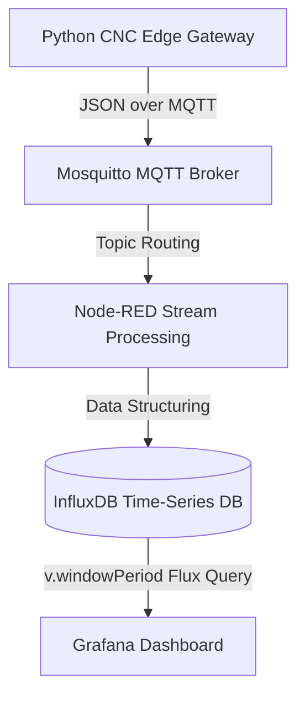

# Industrial Edge Telemetry Pipeline

> A fully containerized, end-to-end IIoT data infrastructure for industrial condition monitoring — built as the foundational layer for digital-twin and predictive-maintenance research.

[](https://www.python.org/)
[](https://mosquitto.org/)
[](https://nodered.org/)
[](https://www.influxdata.com/)
[](https://grafana.com/)
[](https://docs.docker.com/compose/)

---

## 📌 Objective

An end-to-end, fully containerized edge computing architecture designed to extract, route, and visualize high-frequency machine telemetry. Built as a foundational data infrastructure for IIoT Digital Twin condition monitoring, supporting my M.Sc. Advanced Manufacturing research at TU Chemnitz.

The project addresses a real manufacturing problem: industrial production lines generate continuous sensor data from PLCs, CNC machines, and discrete equipment. Without a reliable pipeline to capture, transform, and visualize this telemetry, predictive-maintenance analytics and digital-twin frameworks have no foundation. This repository demonstrates the IT–OT infrastructure layer that makes downstream semantic modelling and machine learning possible.

---

## 📊 Live Dashboard


The Grafana dashboard renders live `MACHINE_TEMP` telemetry, with a 100 °C operator-awareness threshold line, a real-time Stat panel for the current value, and adaptive historical trend retention via a custom downsampled Flux query.

---

## 🏗️ System Architecture


```mermaid
flowchart TD
    A[Python CNC Edge Gateway] -->|JSON over MQTT| B[Mosquitto MQTT Broker]
    B -->|Topic Routing| C[Node-RED Stream Processing]
    C -->|Data Structuring| D[(InfluxDB Time-Series DB)]
    D -->|v.windowPeriod Flux Query| E[Grafana Dashboard]
```

The architecture follows a classic IIoT pipeline pattern:

1. **Edge gateway** simulates CNC telemetry and publishes structured JSON over MQTT with Last Will Testament for connection resilience
2. **MQTT broker** routes messages by topic to subscribed consumers
3. **Node-RED** parses payloads and writes structured points into InfluxDB
4. **InfluxDB** stores time-series data with configurable retention
5. **Grafana** queries InfluxDB using a custom downsampled Flux query for accurate rendering at any time range

---

## 🛠️ Tech Stack

| Layer | Technology | Role |
|-------|-----------|------|
| Edge Gateway | Python 3.11 · `paho-mqtt` | Telemetry simulation, MQTT publishing with LWT |
| Messaging | Eclipse Mosquitto 2.0 | MQTT broker, topic-based routing |
| Stream Processing | Node-RED 3.x | Payload parsing, transformation, InfluxDB write |
| Storage | InfluxDB 2.7 | Time-series database with retention |
| Visualization | Grafana 10.x | Dashboards with custom Flux queries |
| Orchestration | Docker · Docker Compose | One-command reproducible deployment |

---

## 📁 Repository Structure

```
.
├── cnc_sensor.py                    # Python edge gateway (MQTT publisher with LWT)
├── Dockerfile                       # Builds the cnc-gateway container image
├── docker-compose.yml               # Orchestrates all 5 services
├── requirements.txt                 # Python dependencies for the edge gateway
├── NodeRED_Flow.json                # Importable Node-RED flow definition
├── Grafana_Dashboard.json           # Importable Grafana dashboard definition
├── machine_temp_downsample.flux     # Custom Flux query for adaptive downsampling
├── dashboard.png                    # Screenshot of the live dashboard
└── README.md
```

---

## 🚀 Quick Start

**Prerequisites:** Docker Desktop (or Docker Engine with Docker Compose v2) installed.

```bash
# Clone the repository
git clone https://github.com/IIoT-Edge-Telemetry-Pipeline
/industrial-edge-telemetry-pipeline.git
cd industrial-edge-telemetry-pipeline

# Start the full stack
docker compose up -d

# Verify all five services are running
docker compose ps
```

Then open in your browser:

| Service | URL | Default credentials |
|---------|-----|---------------------|
| Grafana | http://localhost:3000 | `admin` / `admin` (change on first login) |
| Node-RED | http://localhost:1880 | — |
| InfluxDB | http://localhost:8086 | configured on first run |

To stop the stack:

```bash
docker compose down
```

---

## ⚙️ Configuration

The Python edge gateway reads its MQTT broker target from environment variables. Defaults are set for the Docker Compose network and can be overridden via the `environment` block in `docker-compose.yml` or a `.env` file.

| Variable | Default | Description |
|----------|---------|-------------|
| `MQTT_BROKER` | `mqtt-broker` | Hostname or IP of the MQTT broker |
| `MQTT_PORT` | `1883` | MQTT broker port |
| `MQTT_TOPIC` | `factory/chemnitz/cnc_1/sensors` | Telemetry publish topic |
| `MQTT_STATUS_TOPIC` | `factory/chemnitz/cnc_1/state` | Connection-state topic (LWT) |

---

## 🔁 Reproducing the Full Setup

For first-time setup after `docker compose up -d`, the Node-RED flow and Grafana dashboard need to be imported once. After this initial step, both configurations persist via Docker volumes across restarts.

### Step 1 · Import the Node-RED flow

1. Open Node-RED at <http://localhost:1880>
2. Menu (top right) → **Import**
3. Select **upload a file** and choose `NodeRED_Flow.json` from this repository
4. Click **Import**, then **Deploy** (red button, top right)

### Step 2 · Connect Grafana to InfluxDB

1. Open Grafana at <http://localhost:3000>
2. Sign in (default `admin` / `admin`) and change the password
3. **Connections → Data sources → Add data source → InfluxDB**
   - Query language: **Flux**
   - URL: `http://influxdb:8086`
   - Organization, token, and bucket: as configured during InfluxDB first-run setup at <http://localhost:8086>

### Step 3 · Import the Grafana dashboard

1. **Dashboards → New → Import**
2. Upload `Grafana_Dashboard.json`
3. Select the InfluxDB data source created in Step 2 and click **Import**

The custom downsampling query lives in `machine_temp_downsample.flux` — Grafana's panel references it via the `v.windowPeriod` variable for adaptive resolution at any time range, from the last minute to a full historical run.

### Verifying the data flow

After completing the steps above:

1. Grafana should display live `MACHINE_TEMP` values updating every few seconds
2. Node-RED's debug panel should show incoming JSON payloads under `factory/chemnitz/cnc_1/sensors`
3. The dashboard's threshold line at 100 °C should mark the overheating boundary, with the Stat panel reflecting the current value

---

## 🗺️ Project Roadmap

This repository represents **Phase 1** of a layered Industry 4.0 digital-twin architecture I am building incrementally. The phased structure reflects how production-grade digital twins are typically built: stable infrastructure first, then connectivity, semantics, and analytics.

| Phase | Scope | Status |
|-------|-------|--------|
| **Phase 1** | Data infrastructure — Python edge, MQTT, Node-RED, InfluxDB, Grafana, Docker | ✅ **Complete** |
| **Phase 2** | OPC UA integration as the bridge from real PLCs to the existing pipeline | 🟡 In progress |
| **Phase 3** | Semantic modelling via Asset Administration Shell (Eclipse BaSyx), aligned to BFO / IOF ontologies | 🟢 Planned |
| **Phase 4** | Machine learning — anomaly detection and predictive-maintenance models on the time-series data | 🟢 Planned |

Phases 3 and 4 are explicitly motivated by my interest in research on AAS-based digital twins and semantic-ML integration in industrial production environments.

---

## 👤 About

Built by **Nitin Senthilkumar**, M.Sc. Advanced Manufacturing student at **Technische Universität Chemnitz** (TU Chemnitz). Manufacturing-engineering background with focus on Industry 4.0, the IT–OT interface, and industrial data systems.

📧 [nitin.senthilkumar@s2025.tu-chemnitz.de](mailto:nitin.senthilkumar@s2025.tu-chemnitz.de)
🎓 M.Sc. Advanced Manufacturing · TU Chemnitz

---

## 📄 License

Released for academic and demonstration purposes. Free to reference for research and learning.
